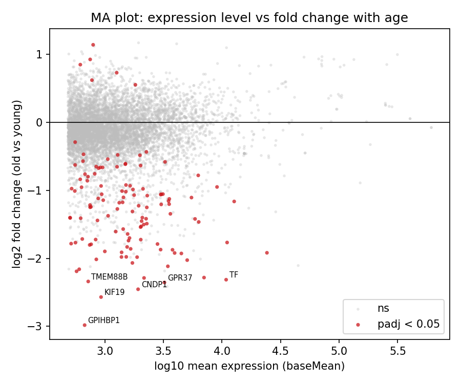

# RNA-seq Aging Differential Expression: Young vs Old Human Brain

Finds genes differentially expressed between young and old human cortex using the
standard DESeq2 workflow, on public data, fully reproducible.

Version 1.1.0

## Result

119 genes are differentially expressed at 5 percent FDR between young and old
human cortex (GSE104704, 8 young and 10 aged donors). The change is strongly
one-sided: 113 genes go down with age and only 6 go up. Several of the strongest
genes are associated with oligodendrocytes and myelin (for example ZNF488, GJC2,
CNDP1), which is consistent with the well-documented decline of myelin integrity
in brain aging.

## Explore it

An interactive explorer lets you search any gene and see its age-related change,
hover over an interactive volcano, and filter the full results table:

    pip install -r requirements.txt
    streamlit run app.py

## What this is

RNA-seq counts how active each gene is. This project compares gene activity in
young versus old human brain to find which genes change with age, using negative
binomial count modeling (DESeq2) with multiple-testing correction. It is a
computational analysis of public data, not wet-lab work.

## Data

GSE104704 (Nativio et al., human brain, healthy young vs old), pulled as
uniformly processed counts from NCBI. Sample group labels are parsed from the
series metadata at runtime, not hardcoded. No data is committed to this repo; the
first pipeline run downloads it.

## Methods

DESeq2 (via pydeseq2) models each gene's integer counts with a negative binomial
distribution, shares variance across genes to stabilize estimates on small
samples, and applies Benjamini-Hochberg correction. Genes are pre-filtered to
those with at least 10 total reads. Positive log2 fold change means higher in old.

## Reproduce

    python -m venv .venv
    .venv\Scripts\python.exe -m pip install -r requirements.txt
    .venv\Scripts\python.exe run_all.py

The first run downloads the counts and annotation, then runs the analysis and
writes the table, metrics, and figures. Reruns skip the download. Pathway
enrichment needs internet (Enrichr) and runs separately or with a flag:

    .venv\Scripts\python.exe src\enrichment.py
    .venv\Scripts\python.exe run_all.py --enrichment

## Outputs

- results/de_results.csv: every gene with baseMean, log2 fold change, p value,
  adjusted p, and symbol, sorted by significance
- results/metrics.json: summary counts
- results/pca.png: sample PCA colored by age group
- results/volcano.png: fold change vs significance
- results/ma_plot.png: mean expression vs fold change, significant genes in red
- results/heatmap.png: z-scored expression of the top DE genes
- results/enrichment.png and results/enrichment.csv: pathway over-representation
  of the significant genes, written when src/enrichment.py is run

## Interpretation

The significant set is dominated by downregulation with age and leans toward
genes tied to oligodendrocytes and myelin. Reduced myelin and oligodendrocyte
function is a known feature of human brain aging, so this result is concordant
with prior work rather than a novel biological claim. The pathway enrichment step
gives the data-driven version of this, and if no term passes FDR 0.05, that null
is reported honestly.

## Limitations

Small sample (8 vs 10), typical for this kind of study, so modest effects may not
reach significance. Bulk tissue averages over cell types, so cell-type-specific
changes are invisible. No covariate adjustment for sex or batch. NCBI-pipeline
counts can differ slightly from the authors' own processing, so exact gene-level
numbers may differ from the publication. This is an analysis of public data, not
a clinical or diagnostic tool.

## Citation

Method: Love MI, Huber W, Anders S. Moderated estimation of fold change and
dispersion for RNA-seq data with DESeq2. Genome Biology, 2014.

Data: GSE104704 (Nativio et al.), NCBI Gene Expression Omnibus.
